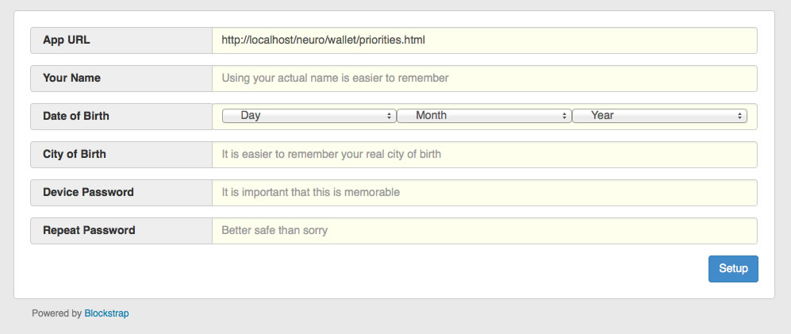
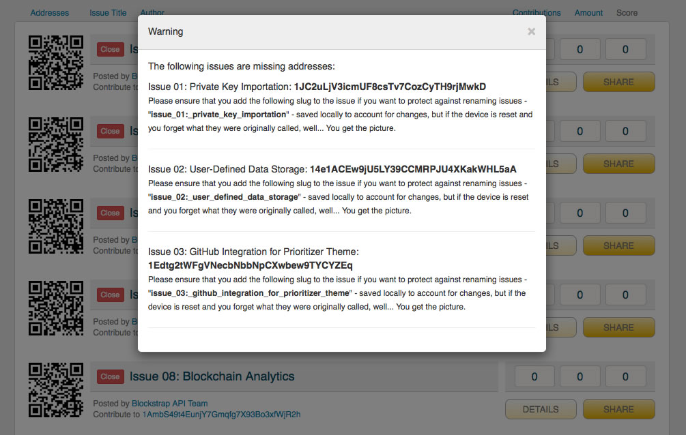
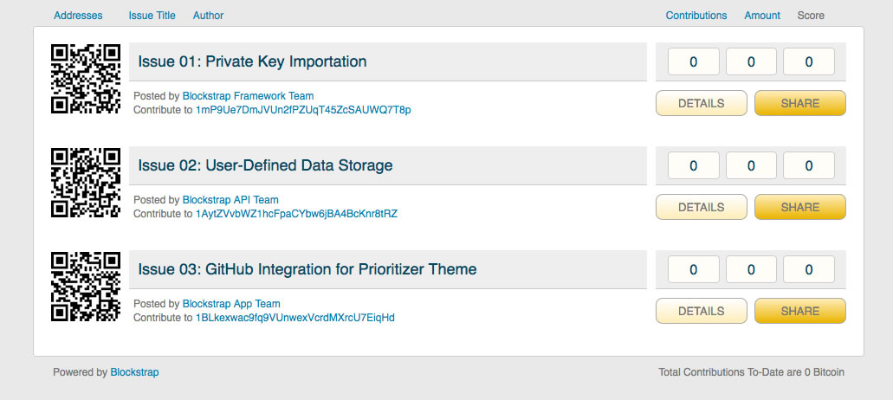

## Prioritizer Installation

Prioritizer is a little different to the default [wallet](../../wallet/) in that it features user and admin views.

These are controlled via new options introduced within `/themes/priority/config.json`:

<!--pre-javascript-->
```
{
    "theme": "priority",
    "public": true,
    "cascade": false,
    "security": "",
    "content_id": "issues",
    "slug_base": "index"
}
```

When setting `public` to true as seen on line 3, Blockstrap will by default assume that the current session belongs to a public user. If the `security` option is not set or empty (as seen on line 5), Blockstrap will assume that the session belongs to an administrator and that the current application has not yet been installed. In this case, you should be presented with the setup screen:



Once completed, you should be prompted to add your security hash to the configuration, as seen in line 5 below:

<!--pre-javascript-->
```
{
    "theme": "priority",
    "public": true,
    "cascade": false,
    "security": "9cd922a3249415349e636f76cff3ad75",
    "content_id": "issues",
    "slug_base": "index"
}
```

We should now be ready to start adding issues. For example, if we start out with the following `/themes/priority/js/dependenccies/issues.json` array:

<!--pre-javascript-->
```
{
    title: 'Issue 01: Private Key Importation',
    details: 'This involves something that needs describing...'
},
{
    title: 'Issue 02: User-Defined Data Storage',
    details: 'This involves something that needs describing...'
},
{
    title: 'Issue 03: GitHub Integration for Prioritizer Theme',
    details: 'This involves something that needs describing...'
}
```

Administrators of the site will be notified when there are issues that do not have addresses, where new ones will be generated based upon the device salt and issue title then asked for them to be added back to the `issues.js` file. The prompt should look something like this:



You will then need to copy the address and slugs back into the `/themes/priority/js/dependenccies/issues.json` array:

<!--pre-javascript-->
```
{
    title: 'Issue 01: Private Key Importation',
    address: '1JC2uLjV3icmUF8csTv7CozCyTH9rjMwkD',
    slug: 'issue_01:_private_key_importation',
    details: 'This involves something that needs describing...'
},
{
    title: 'Issue 02: User-Defined Data Storage',
    address: '14e1ACEw9jU5LY39CCMRPJU4XKakWHL5aA',
    slug: 'issue_02:_user_defined_data_storage',
    details: 'This involves something that needs describing...'
},
{
    title: 'Issue 03: GitHub Integration for Prioritizer Theme',
    address: '1Edtg2tWFgVNecbNbbNpCXwbew9TYCYZEq',
    slug: 'issue_03:_github_integration_for_prioritizer_theme',
    details: 'This involves something that needs describing...'
}
```

Please also note the optional inclusion of the `slug` attribute. Adding this will prevent loss of control should you change the title of an issue. If you do not add this, and then change the issue title later, the theme will be incapable of determining the appropriate keys required to control the corresponding address. Once that's all done, or if you are visiting the site and do not have a device salt that matches-up with the necessary security options, you should be presented with the public view as follows:



Each transaction for each address adds to the contribution count, each of which is worth one point (regardless of the amount), whereas one full coin is worth 10 points (divided as required per transaction). These are defined and currently only configurable by editing `/themes/priority/js/modules/theme.js` in the following section:

<!--pre-javascript-->
```
theme.formulas = {
    tx: 1,
    coin: 10
};
```

---

1. Related Articles
2. [Back to Prioritizer](../../prioritizer/)
3. [Installation](../installation/)
4. [Table of Contents](../../../)
