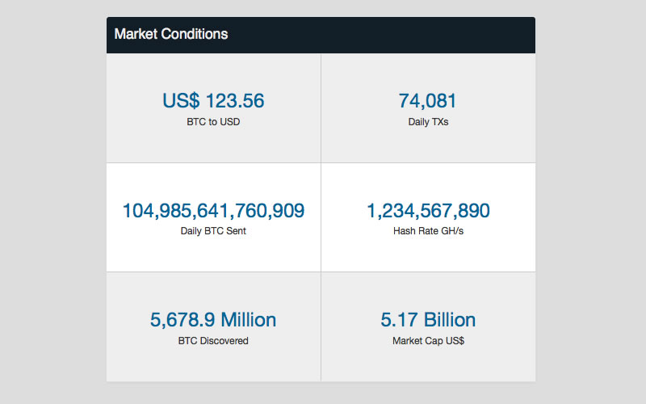

## The Markets Plugins

The `markets.js` plugin is currently used by the default theme to display market conditions as widgets on the dashboard.



If activated via configuration it can then be used from within a data array as seen in `themes/default/data/index.json`:

<!--pre-javascript-->
```
{
    "id": "market-conditions",
    "css": "col-md-6 even",
    "header": "Market Conditions",
    "body": {
        "func": "plugin",
        "name": "markets",
        "call": "filter",
        "data": [
            {
                "css": "col-sm-6 panel",
                "id": "btc_to_usd"
            },
            {
                "css": "col-sm-6 panel",
                "id": "daily_txs"
            },
            {
                "css": "col-sm-6 panel",
                "id": "daily_sent"
            },
            {
                "css": "col-sm-6 panel",
                "id": "hash_rate"
            },
            {
                "css": "col-sm-6 panel",
                "id": "btc_discovered"
            },
            {
                "css": "col-sm-6 panel",
                "id": "market_cap"
            }
        ]
    }
}
```

This then gets filtered via the `$.fn.blockstrap.plugins.markets.filter` function as follows:

<!--pre-javascript-->
```
markets.filter = function(data)
{
    var objs = [];
    if($.isArray(data))
    {
        $.each(data, function(k, object)
        {
            var css = '';
            var obj = false;
            var content = '';
            if(object.css) css = object.css;
            if(conditions[object.id]) obj = conditions[object.id];
            if(obj.prefix) content+= obj.prefix + ' ';
            if(obj.value) content+= Number(parseFloat(obj.value).toFixed(2)).toLocaleString();
            if(obj.affix) content+= ' ' + obj.affix;
            var html = markets.span(obj.text, content);
            objs.push({css: css, html: html});
        });
    }
    var market_conditions = Mustache.render($.fn.blockstrap.snippets['lists'], {
        objects: [
            {
                id: 'market-conditions',
                items: objs
            }
        ]
    });
    return market_conditions;
}
```

As seen on line 20 above, the function uses the `$.fn.blockstrap.snippets` functionality in combination with Mustache templating to merge the data with an appropriate and pre-defined HTML structure that could be easily changed as required.


--------------------------------------------------------------------------------

1. Related Articles
2. [Return to Plugins](../)
4. [Table of Contents](../../)